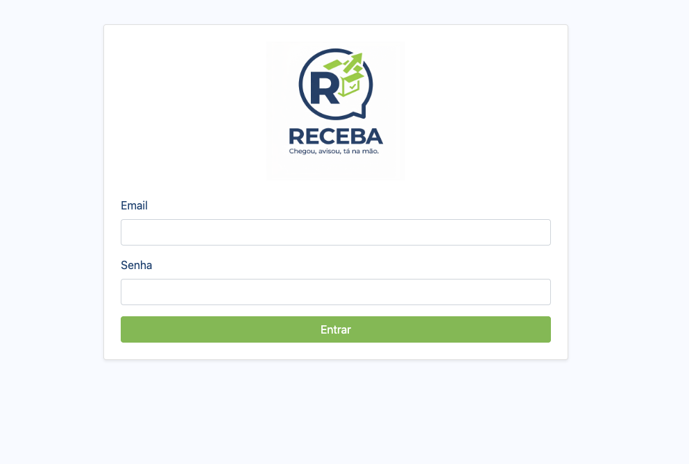
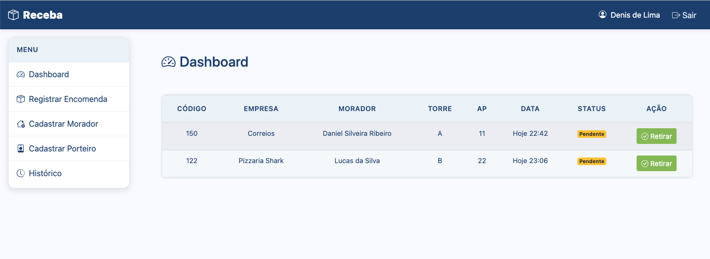
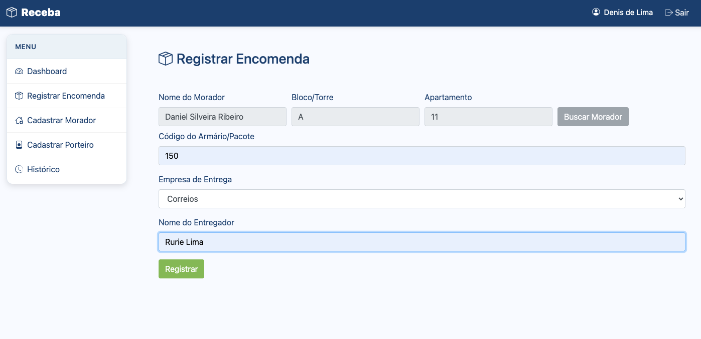
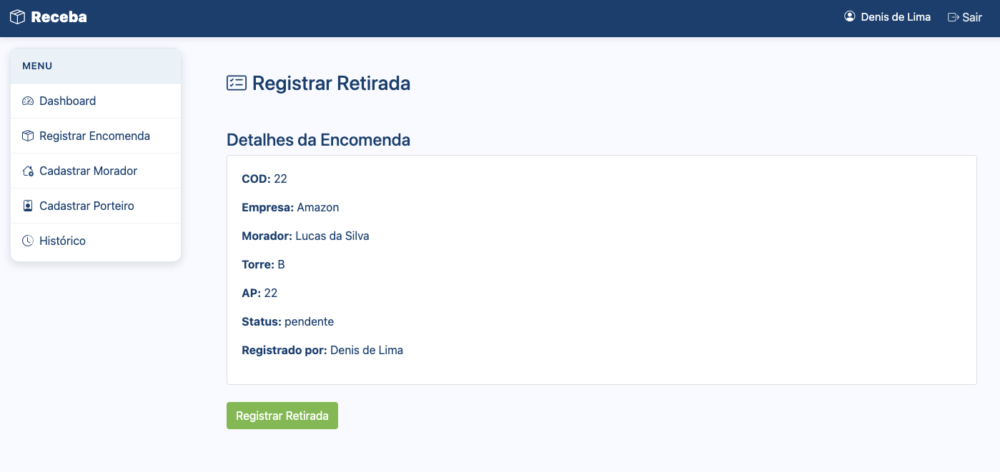
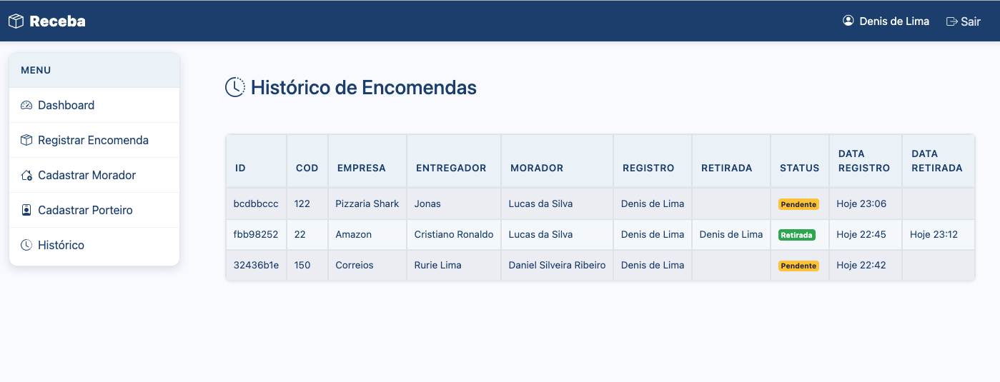

# Receba - Sistema de Gerenciamento de Encomendas

O **Receba** é um sistema web para controle de encomendas em condomínios. Ele foi desenvolvido em **Python**, com **Flask** e **SQLite**, para ajudar a portaria a registrar entregas, acompanhar encomendas pendentes e controlar a retirada pelos moradores.

A aplicação trabalha com login de porteiros, cadastro de moradores, registro de encomendas, histórico de movimentações e identificação de qual porteiro recebeu ou finalizou cada retirada.

## Imagens do Sistema







## Funcionalidades

- **Acesso de porteiros:**
  - login com e-mail e senha
  - sessão protegida,
  - usuário inicial `admin@receba.com` / `admin`
  - cadastro de novos porteiros com senha criptografada.

- **Cadastro de moradores:**
  - validação de duplicidade por nome + torre + apartamento
  - bloqueio de WhatsApp já cadastrado.

- **Padronização de dados:**
  - nomes de moradores e porteiros são salvos e exibidos em formato padronizado, mesmo quando digitados em letras minúsculas ou maiúsculas; 
  - torre/bloco é salvo em maiúsculas
  - WhatsApp tem validação de quantidade de números e máscara.

- **Registro de encomendas:**
  - cadastro de código do armário/pacote
  - status inicial `pendente`,
  - UUID como identificador interno
  - identificação automática do porteiro que recebeu.

- **Busca e seleção de moradores:**
  - a busca pode ser feita por nome ou por torre/bloco e apartamento;
  - quando há mais de um morador no mesmo apartamento, o sistema permite escolher o morador correto no registro da encomenda.

- **Dashboard de pendentes:**
  - exibe as encomendas com status "pendente",
  - possui botão de ação para iniciar a retirada.

- **Retirada de encomendas:**
  - localiza a encomenda pelo UUID completo ou inicial
  - exibe os dados antes da finalização
  - quando houver mais de um morador no mesmo apartamento, permite escolher quem fez a retirada.

- **Histórico e datas:**
  - lista as encomendas registradas e retiradas, mostrando quem recebeu, quem registrou a retirada e datas formatadas de forma amigável.
  - registros de hoje aparecem como `Hoje HH:MM`, os de ontem como `Ontem HH:MM` e os anteriores com data completa.

- **Segurança e banco local:** 
  - rotas internas protegidas por login e senhas com hash
  - consultas usando SQLAlchemy e banco SQLite (`receba.db`) criado automaticamente na primeira execução criptografado.

## Estrutura do Projeto

```text
base-receba/
├── app.py                         # Configuração da aplicação Flask e inicialização do banco
├── controllers.py                 # Funções de acesso e manipulação dos dados
├── models.py                      # Modelos SQLAlchemy: Porteiro, Morador e Encomenda
├── routes.py                      # Rotas da aplicação
├── requirements.txt               # Dependências do projeto
├── docs/
│   └── images/                    # Prints usados na documentação
│       ├── login.png
│       ├── registrar-encomenda.png
│       └── registrar-retirada.png
├── static/
│   ├── images/                    # Imagens da interface
│   │   ├── logo-icon.png
│   │   └── logo.png
│   └── style/
│       └── style.css              # Estilos da aplicação
├── templates/                     # Telas HTML/Jinja2 da aplicação
│   ├── base.html
│   ├── cadastrar_morador.html
│   ├── cadastrar_porteiro.html
│   ├── dashboard.html
│   ├── historico.html
│   ├── login.html
│   ├── registrar.html
│   └── retirar.html
└── README.md
```

## Pré-requisitos

- Python 3 instalado.
- `pip` instalado.

## Como Executar Localmente

1. Acesse a pasta do projeto:

   ```bash
   cd base-receba
   ```

2. Crie um ambiente virtual:

   ```bash
   python3 -m venv venv
   ```

3. Ative o ambiente virtual:

   No macOS/Linux:

   ```bash
   source venv/bin/activate
   ```

   No Windows:

   ```bash
   venv\Scripts\activate
   ```

4. Instale as dependências:

   ```bash
   pip install -r requirements.txt
   ```

5. Execute a aplicação:

   ```bash
   python app.py
   ```

6. Abra no navegador:

   ```text
   http://127.0.0.1:5001
   ```

7. Faça o primeiro login com:

   ```text
   Email: admin@receba.com
   Senha: admin
   ```

8. Cadastre um novo porteiro, clique em **Sair** e entre com a nova conta para começar a registrar encomendas.

## Banco de Dados

O banco SQLite é criado automaticamente pelo Flask/SQLAlchemy na primeira execução da aplicação.

Por padrão, a configuração usa:

```python
sqlite:///receba.db
```

## Observações

- A aplicação foi pensada para uso em computador.
- Para produção, altere a `SECRET_KEY` em `app.py`.
- Também é recomendado trocar a senha inicial do fluxo administrativo criando um porteiro real e evitando o uso contínuo do usuário `Admin`.
